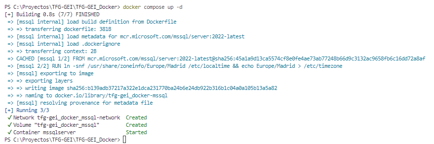
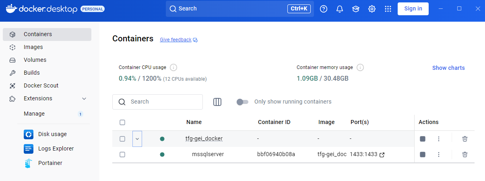
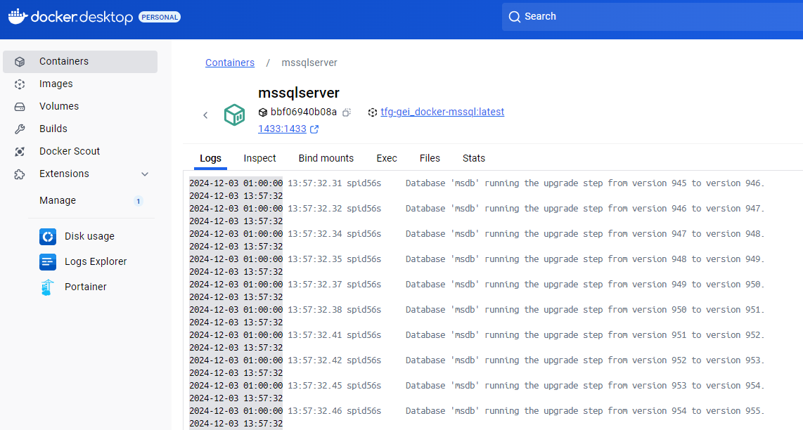
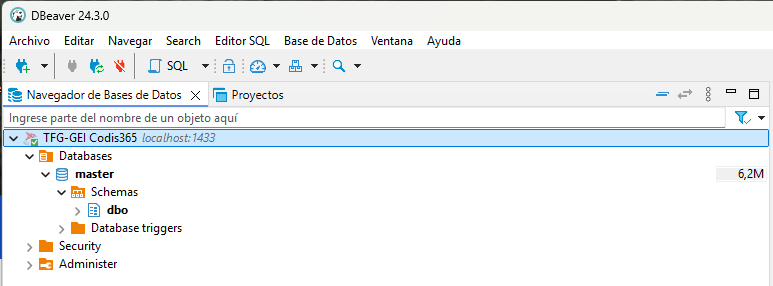
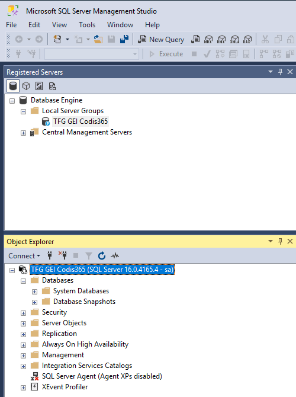

<!-- PROJECT LOGO -->
<br />
<div align="center">
  
  <h3 align="center">README.MD</h3>

  <p align="center">
      Aquest fitxer conté les instruccions per al desplegament local del contenidor "Docker" del gestor de bases de dades Microsoft SQL Server en la seva versió més recent.
    <br />
  </p>
</div>

<!-- TABLE OF CONTENTS -->
<details>
  <summary>Taula de continguts</summary>
  <ol>
    <li><a href="#introduction">Introducció</a></li>
    <li><a href="#requirements">Requeriments</a></li>
    <li><a href="#installation">Instal·lació</a></li>
    <li><a href="#instructions">Instruccions</a></li>
    <li><a href="#documentation">Documentació addicional</a></li>
  </ol>
</details>

<!-- INTRODUCTION -->
## Introducció
<div id="introduction"></div>

L'objectiu d'aquest projecte és proporcionar a l'equip de desenvolupament la infraestructura local al seu ordinador per aprovisionar una base de dades SQL Server dockeritzada. El principal benefici és poder desenvolupar el producte localment sense necessitat de connectar-se a la base de dades compartida. En pocs minuts, es pot obtenir una còpia del gestor de bases de dades local llesta per al seu funcionament.

<!-- REQUIREMENTS -->
## Requeriments
<div id="requirements"></div>

Es requereix una còpia local del producte Docker Desktop per a ordinadors amb Windows, que es pot descarregar des del següent enllaç: 

[Docker website](https://www.docker.com)

<!-- INSTALLATION -->
## Instal·lació
<div id="installation"></div>

Clona el repositori en una carpeta local i executa la següent comanda:

```def
        docker compose up -d
```
La sortida al terminal o shell hauria de ser com es mostra a continuació:

<div id="block" align="center">
    <div class="inline-block" style="display: inline-block; width: 30%">
        
    </div>
</div>


<!-- INSTRUCTIONS -->
## Instruccions
<div id="instructions"></div>

Utilitza les següents comandes per iniciar, aturar o llistar tots els contenidors desplegats disponibles:

```def
        docker ps -a					           # Get a list of all available containers
        docker start [container_namer_or_ID]	   # Start a container
        docker stop [container_namer_or_ID]		   # Stops a container
```

A continuació es mostren algunes captures de pantalla de com hauria de quedar el contenidor iniciat i algunes proves de connexió a la nova base de dades:

<div id="block" align="center">
    <div class="inline-block" style="display: inline-block; width: 30%">
        
    </div>
    <br>
    <div class="inline-block" style="display: inline-block; width: 30%">
        
    </div>
    <br>
    <div class="inline-block" style="display: inline-block; width: 30%">
        
    </div>
    <div class="inline-block" style="display: inline-block; width: 30%">
        
    </div>
</div>


<!-- DOCUMENTATION -->
## Documentació
<div id="documentation"></div>

Podeu consultar informació addicional sobre la configuració de Docker Desktop i MSSQL Server es pot trobar al següent enllaç:

[Com instal·lar Docker Desktop en Windows](https://docs.docker.com/desktop/setup/install/windows-install/) 
[Com instal·lar Docker Desktop en Linux](https://docs.docker.com/desktop/setup/install/linux/) 
[Configurar SQL Server a Linux](https://learn.microsoft.com/en-us/sql/linux/sql-server-linux-configure-environment-variables)